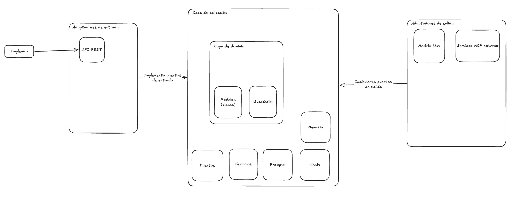
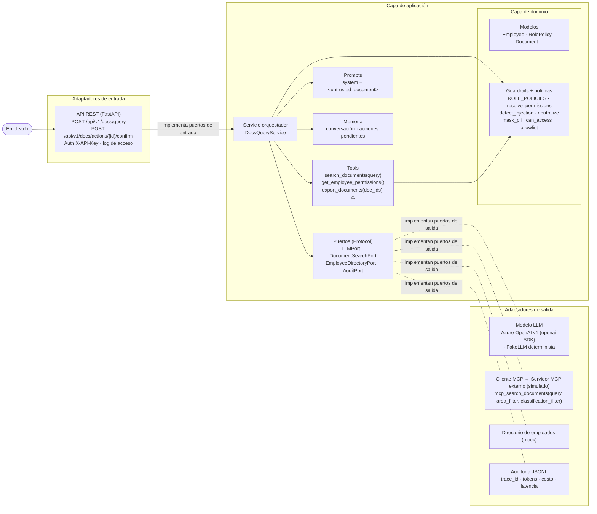
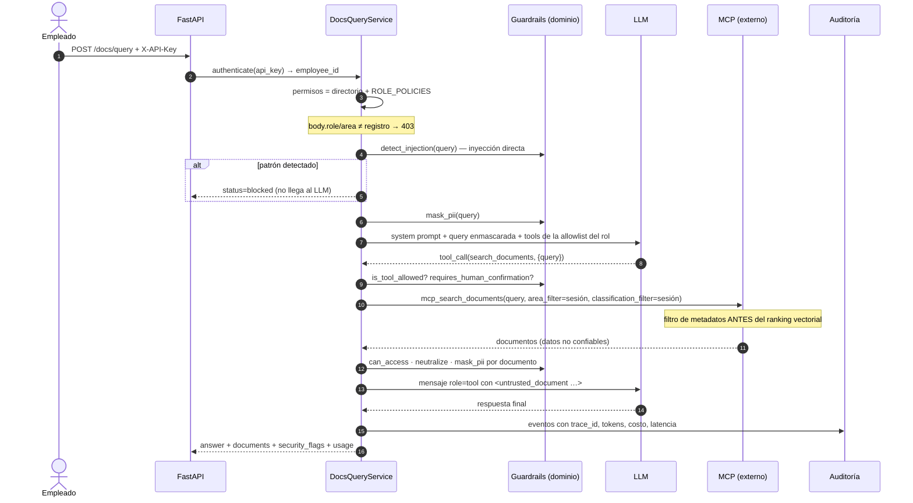

# Arquitectura

Arquitectura hexagonal (puertos y adaptadores). El dominio no depende de nada; la aplicación
depende solo del dominio y de sus puertos (`typing.Protocol`); los adaptadores implementan
esos puertos y `bootstrap.py` los conecta (composition root).

## Borrador original

## Vista de componentes

## Flujo seguro de una consulta

## Controles de seguridad y dónde viven

| Control | Ubicación |
|---|---|
| Autenticación (API key → employee_id, comparación en tiempo constante) | `adapters/inbound/api.py`, `adapters/outbound/directory.py` |
| RBAC por rol, deny by default | `domain/policies.py` |
| Rol/área del body verificados contra el registro | `application/service.py::_authorize` |
| Filtros de metadatos antes de la recuperación | `application/tools.py::_search` → `mcp_server_mock.py` |
| Revalidación de acceso tras la recuperación | `domain/guardrails.py::can_access` |
| Allowlist en exposición y en ejecución | `tools.py::schemas_for`, `service.py` (bucle de tools) |
| Tools sin parámetros de identidad/área; args extra ignorados | `application/tools.py` |
| Inyección directa (query) bloqueada antes del LLM | `service.py` + `guardrails.detect_injection` |
| Inyección indirecta neutralizada por oración, sin bloquear el documento | `guardrails.neutralize` |
| Separación de datos e instrucciones (`<untrusted_document>`, escape de `< >`) | `application/prompts.py` |
| PII enmascarada antes del LLM | `guardrails.mask_pii` |
| Confirmación humana determinista (lista fija, uso único, TTL, dueño) | `policies.SENSITIVE_TOOLS`, `service.confirm` |
| Auditoría JSONL + log de acceso HTTP | `adapters/outbound/audit_jsonl.py`, middleware en `api.py` |
